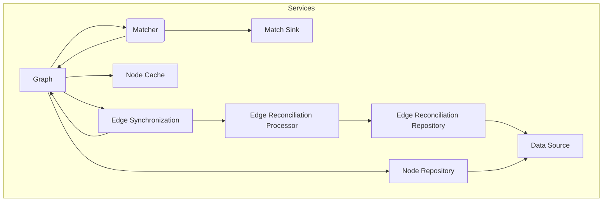

The project implements a framework for streaming graph analysis.
It uses an idea from [Quine](https://quine.io) to build a graph from a stream,
and to implement _standing queries_ that are run on the graph data as the graph changes.

A Graph manages a persistent graph store, with a cache of nodes.
The two operations on Graph are **get** and **append**.
As nodes are appended to the graph model, any nodes that have changed are matched
against a specification of a subgraph, producing a stream of matches.

# Objectives

This project was started as an exercise to learn Scala 3 and ZIO 2.

Some of the ideas that I wanted to explore include:
* Using _Software Transactional Memory_ to create a completely lock-free implementation.
* Implement a strong eventual consistency model for edge
maintenance while at the same time completely avoiding deadlock.
* Maximize parallelism, especially for standing query evaluation.
How much continuous query evaluation can we manage for a given rate of change.
* Return every possible match that happens at every point in time.
* Support idempotent batch update operations (e.g., for committing a stream window).

# Query Language (or lack thereof)

There is no query language (as in Cypher implemented for Quine).
The equivalent is a simple predicate language that is used to specific
constraints on the subgraph. This is almost certainly less powerful that
a full graph query language, but it is not clear that this is a limitation
in actual applications.

Quine implements the Cypher query language. My vision for this implementation is not to have
any sort of query language at all but just a simple Scala DSL to expression queries.

# Concurrency Model

While the Quine implementation uses the Akka actor model, this implementation uses ZIO 2.
Where Quine/Akka uses the Actor mailbox to ensure that the graph evolves in a consistent way,
this implementation explores the idea of a graph datastore that is completely lock free.
This uses _software transactional memory_ as the primary synchronization mechanism.

# Eventual Consistency

The other significant area that has been explored is the eventual consistency model.
The actor-based implementation is subject to deadlock due to the synchronous updating of
the far half-edges. In this model, only the near half-edge is updated as part of an append,
and the far half-edge is done in an eventually-consistent way. The `EdgeReconciliationService`
tracks (in a memory-bounded and efficient way) that all half-edges are consistent.

The Quine implementation is limited in how it interacts with a Kafka data source.
While it can source changes from Kafka, it does not implement any idea of backpressure or
ensure than the those changes have been consumed successfully by the graph.
This implementation is designed to provide accurate feedback to Kafka so that when an append
request sent to the graph is completed successfully:
* Any changes have been persisted to the graph state, and
* All standing queries that could be affected by the change have been evaluated, 
and any matches have been committed to the query output stream.

The goal is that a Kafka Consumer could send a window of changes to the graph, and once they are complete, it would commit the offset for that window.

# Service Architecture

The following diagram shows the overall service dependencies (configuration and tracing
services are not shown). The central service is *Graph*, and this service provides
the external API that allows events to be appended to the graph, and nodes in the graph to be retrieved.
Each of these services is implemented as a ZIO Layer. The exception to this is
that the *Matcher* component which is instantiated each a group of node mutations is
processed. The *Graph* service has a dependency on *Match Sink* which is not shown
on this diagram (it is passed to the *Matcher* each a *Matcher* is instantiated).

The services that *Graph* collaborates with are:
* *NodeCache* - An in-memory cache tuned to the requirements of graph.
* *EdgeSynchronization* - Ensures that when a half-edge is created (by appending events to the graph),
that the other corresponding half-edge is also added to the graph model. This is done in an eventually-consistent
way, so the edge synchronization service collaborates with the edge reconciliation processor to provide an audit
trail of reconciliation (i.e., to ensure that the graph reaches consistency).
* *Matcher* - As the graph changes, changed nodes are matched against a subgraph specification
and any subgraphs that match the subgraph spec are emitted to the Match Sink, which is
the output for this system.
* *Node Repository* - Implements a persistent store for graph nodes.

