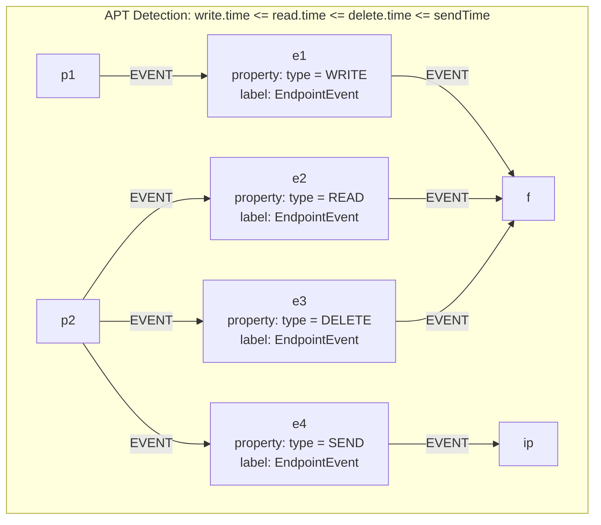

This is example attempts to reproduce the behaviour of the [APT Detection](https://quine.io/recipes/apt-detection) from Quine.
Only the standing query logic is reproduced in this case.

The original Quine recipe include two input files [endpoint.json](https://recipes.quine.io/apt-detection/endpoint-json)
and [network.json](https://recipes.quine.io/apt-detection/network-json). 
I have implemented the ingestion of both of these files into the graph, but it appears
that only the `endpoint.json` data is relevant to this example.

- Added `EndpointEvent` label on those nodes (might not be necessary, revisit this)
- TODO: Use a different key on the events - reduces number of nodes to be matched

Here is the original standing query from the Quine APT Detection example:
```yaml
standingQueries:
  - pattern:
      type: Cypher
      query: >-
        MATCH (e1)-[:EVENT]->(f)<-[:EVENT]-(e2), 
              (f)<-[:EVENT]-(e3)<-[:EVENT]-(p2)-[:EVENT]->(e4)
        WHERE e1.type = "WRITE"
          AND e2.type = "READ"
          AND e3.type = "DELETE"
          AND e4.type = "SEND"
        RETURN DISTINCT id(f) as fileId
    outputs:
      stolen-data:
        type: CypherQuery
        query: >-
          MATCH (p1)-[:EVENT]->(e1)-[:EVENT]->(f)<-[:EVENT]-(e2)<-[:EVENT]-(p2), 
                (f)<-[:EVENT]-(e3)<-[:EVENT]-(p2)-[:EVENT]->(e4)-[:EVENT]->(ip)
          WHERE id(f) = $that.data.fileId
            AND e1.type = "WRITE"
            AND e2.type = "READ"
            AND e3.type = "DELETE"
            AND e4.type = "SEND"
            AND e1.time < e2.time
            AND e2.time < e3.time
            AND e2.time < e4.time

          CREATE (e1)-[:NEXT]->(e2)-[:NEXT]->(e4)-[:NEXT]->(e3)

          WITH e1, e2, e3, e4, p1, p2, f, ip, "http://localhost:8080/#MATCH" + text.urlencode(" (e1),(e2),(e3),(e4),(p1),(p2),(f),(ip) WHERE id(p1)='"+strId(p1)+"' AND id(e1)='"+strId(e1)+"' AND id(f)='"+strId(f)+"' AND id(e2)='"+strId(e2)+"' AND id(p2)='"+strId(p2)+"' AND id(e3)='"+strId(e3)+"' AND id(e4)='"+strId(e4)+"' AND id(ip)='"+strId(ip)+"' RETURN e1, e2, e3, e4, p1, p2, f, ip") as URL
          RETURN URL
        andThen:
          type: PrintToStandardOut
```

Here is a graphical representation of this query:


This also adds property existence qualifiers on the 
*Target of a SEND event* and *File* nodes. These properties
are known to be used for output (i.e., for analysis of graph matches)
so we include predicates for them to make this clearer.
happen in within the time resolution of 1 ms.

The time comparisons are represented as a post-filter expression
(which is included in the subgraph description).
This mechanism allows for general filter predicates to be constructed
on subgraph that has been fully matched on the node and
edge predicates.

# Reducing Matching Complexity

- Include the type of the event in the edges from p1, p2 to the event nodes.
- Reduces complexity of matching: initial comparison in SQE can filter on properties of nodes directly
without needing to do any deep analysis (potentially fetching more nodes from cache).

# Edge predicate re-write

When an edge references a node that is unqualified, that predicate can be re-written
to move the predicate to the other node...

# Prune Events

If we are not interested in exploring events beyond the four types that are matched
(i.e., WRITE, SEND, DELETE and READ), then events with all other types could be dropped
at ingestion time and simply not be included in the graph. In addition to avoiding the
ingestion overhead, it also reduces the cost of matching.

This kind of pruning would be suitable for a runtime where there is only the requirement to
match the given subgraph spec.

# Eliminate EndpointEvent Nodes Completely!

If you encode the time in the edge key, then the EndpointEvent nodes could be eliminated completely.
This reduces the number of nodes in the graph by half, but adds complexity to edge key predicate processing.